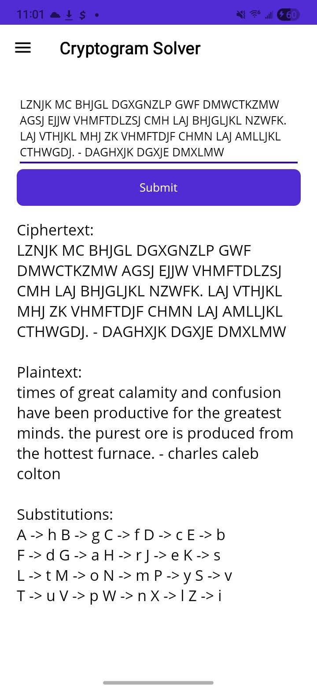

# MauiSolver

Cross platform puzzle solver application using .NET MAUI. Currently supports solving cryptograms and sudokus on Android and Windows. macOS / iOS is supported in theory (not tested yet)

Uses aquach's cyrptogram solver: 

https://github.com/aquach/cryptogram-solver

Ported to C#:

https://github.com/terracotta004/CryptogramSolver

Used with permission from COPYING MIT license (included).

Made with Visual Studio Code and ChatGPT.

